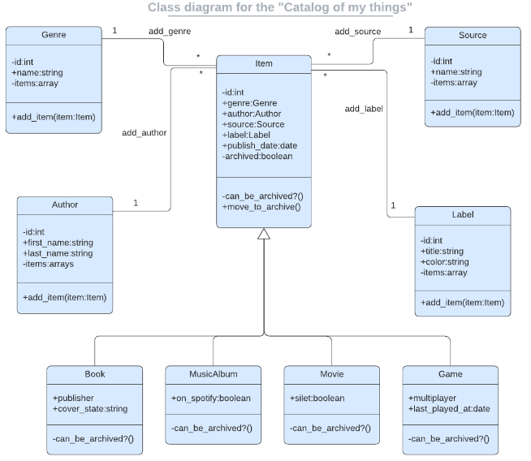

<a name="readme-top"></a>
<div align="center">
  
  <br/>

  <h3><b>Ruby Group Capstone: Catalog of My Things</b></h3>

</div>

<!-- TABLE OF CONTENTS -->

# 📗 Table of Contents

- [📖 About the Project](#about-project)
  - [🛠 Built With](#built-with)
    - [Tech Stack](#tech-stack)
    - [Key Features](#key-features)
- [💻 Getting Started](#getting-started)
  - [Prerequisites](#prerequisites)
  - [Setup](#setup)
  - [Install](#install)
  - [Usage](#usage)
  - [Run tests](#run-tests)
- [👥 Authors](#authors)
- [🔭 Future Features](#future-features)
- [🤝 Contributing](#contributing)
- [⭐️ Show your support](#support)
- [🙏 Acknowledgements](#acknowledgements)
- [📝 License](#license)

<!-- PROJECT DESCRIPTION -->

# 📖 Catalog of My Things <a name="about-project"></a>

**Catalog of My Things** is a console app that will help a user to keep a record of different types of things he owns: books, music albums, and games. Everything will be based on the UML class diagram presented above. The data will be stored in JSON files but we will also prepare a database with tables structure analogical to our program's class structure.

## 🛠 Built With <a name="built-with"></a>

### Tech Stack <a name="tech-stack"></a>

<details>
  <summary>Client</summary>
  <ul>
    <li><a href="https://www.ruby-lang.org/en/documentation/">Ruby</a></li>
    <li><a href="https://rspec.info//">Rspec</a></li>
  </ul>
</details>

<details>
<summary>Database</summary>
  <ul>
    <li><a href="https://www.postgresql.org/">PostgreSQL</a></li>
  </ul>
</details>

<!-- Features -->

### Key Features <a name="key-features"></a>

- **Create Books, Music Albums, and Games list**
- **Preserve data**
- **Tracking Data**

<p align="right">(<a href="#readme-top">back to top</a>)</p>

<!-- GETTING STARTED -->

## 💻 Getting Started <a name="getting-started"></a>

### Prerequisites

In order to run this project you need:

```sh
 gem install bundler
```


### Setup

Clone this repository to your desired folder:


```sh
  cd my-folder
  git https://github.com/rivasbolinga/my-things.git
```
-

### Install

Install this project with:


```sh
  cd my-project
  bundle install
```
-

### Usage

To run the project, execute the following command:


```sh
  ruby main.rb
```

### Run tests

To run tests, run the following command:


```sh
  rspec spec
```

<p align="right">(<a href="#readme-top">back to top</a>)</p>

<!-- AUTHORS -->

## 👥 Authors <a name="authors"></a>

> Mention all of the collaborators of this project.

👤 **Author1**

- GitHub: [@rivasbolinga](https://github.com/rivasbolinga)
- Twitter: [@AndreaRivasPal](https://twitter.com/AndreaRivasPal)
- LinkedIn: [andrearivaspalacios](https://www.linkedin.com/in/andrearivaspalacios/)

👤 **Author2**

- GitHub: [@momo-87](https://github.com/momo-87)
- Twitter: [@Momo-yde](https://twitter.com/Momo_yde)
- LinkedIn: [christian-momo](https://www.linkedin.com/in/christian-momo/)


👤 **Author3**

- GitHub: [@mohametalmeari](https://github.com/mohametalmeari)
- Twitter: [@MohametAlmeari](https://twitter.com/MohametAlmeari)
- LinkedIn: [mohamet-almeari](https://www.linkedin.com/in/mohamet-almeari)

<p align="right">(<a href="#readme-top">back to top</a>)</p>

<!-- FUTURE FEATURES -->

## 🔭 Future Features <a name="future-features"></a>

- [] **Add Movies**
- [] **Remove a selected book**
- [] **Add genre to selected book**

<p align="right">(<a href="#readme-top">back to top</a>)</p>

<!-- CONTRIBUTING -->

## 🤝 Contributing <a name="contributing"></a>

Contributions, issues, and feature requests are welcome!

Feel free to check the [issues page](https://github.com/rivasbolinga/my-things/issues).

<p align="right">(<a href="#readme-top">back to top</a>)</p>

<!-- SUPPORT -->

## ⭐️ Show your support <a name="support"></a>

If you like this project, please give it a star ⭐️.

<p align="right">(<a href="#readme-top">back to top</a>)</p>

<!-- ACKNOWLEDGEMENTS -->

## 🙏 Acknowledgments <a name="acknowledgements"></a>

I would like to thank the Microverse community for their supports.

<p align="right">(<a href="#readme-top">back to top</a>)</p>

<!-- LICENSE -->

## 📝 License <a name="license"></a>

This project is [MIT](https://choosealicense.com/licenses/mit/) licensed.

<p align="right">(<a href="#readme-top">back to top</a>)</p>
